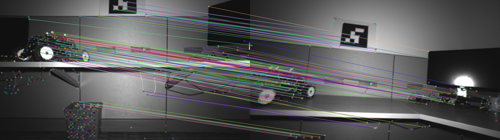

# SuperPoint SuperGlue Acceleration
Accelerate SuperPoint and SuperGlue with TensorRT.

## Demo


## RTX3080 Baseline
* [x] TODO

## Docker(Recommand)
```bash
docker pull yuefan2022/tensorrt-ubuntu20.04-cuda11.6:latest
docker run -it --env DISPLAY=$DISPLAY --volume /tmp/.X11-unix:/tmp/.X11-unix --privileged --runtime nvidia --gpus all --volume ${PWD}:/workspace --workdir /workspace --name tensorrt yuefan2022/tensorrt-ubuntu20.04-cuda11.6:latest /bin/bash
```

## Environment Required
* CUDA
* TensorRT
* OpenCV
* EIGEN
* yaml-cpp

## Build and Run
```bash
git clone https://github.com/yuefanhao/SuperPointSuperGlueAcceleration.git
cd SuperPointSuperGlueAcceleration
mkdir build
cd build
cmake ..
make
./superpointglueacceleration  ../config/config.yaml ../weights/ ${PWD}/../image/image0.png ${PWD}/../image/image1.png
```
